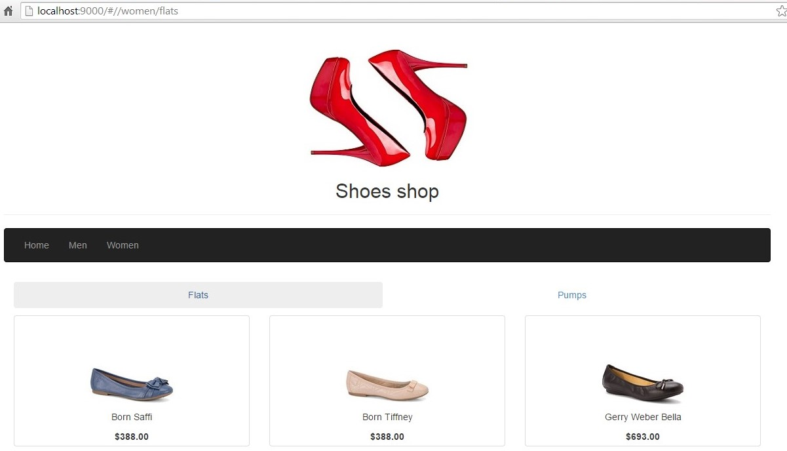
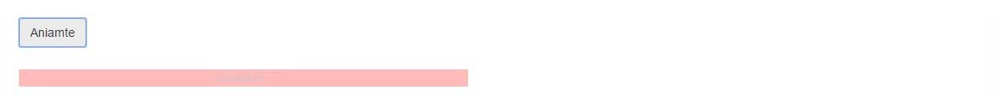

##Exercise 38 : Animating With Javascript
Play with animation. Try to get the effect, such as in Result section.

###Requirements
* create **widthAnimation** class in **animate.js**
* enter animation: you should get a blue bar "Download", changing visibility, increasing width, during 4 seconds
* leave animation: you should get a red bar "Download", changing visibility, decreasing  width, during 2 seconds

###Result
* button pressed






###Before you start, please refer to:
* [angularjs-animating-with-javascript](https://egghead.io/lessons/angularjs-animating-with-javascript)
* use ```bower install```, then add **TweenMax.js** to index.html

Good luck!
