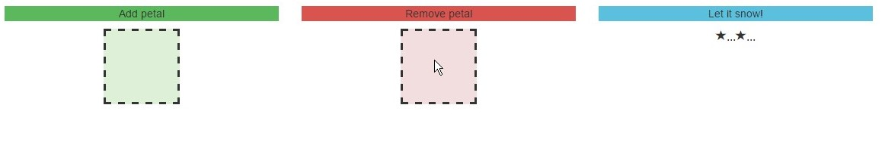

##Exercise 13 : Directives talking to controllers

###The goal
In this exercise, your challenge is to share information between the controller and the directive. 
Implement the functionality to add (when the mouse hovers over the green square) and remove (when the mouse hovers over the green square) snowflake

####Requirements
* **Snow.js** file should contain ***enter*** directive which talks to controller ***SnowCtrl***
* create ***addPetal*** and ***removePetal*** functions to add and remove snowflake form ***snow*** array
* this is your snow pattern petal ```<span class="glyphicon glyphicon-star">...</span>```
* enjoy the stellar snow :)

####Result
* when the mouse hovers over the green square


* when the mouse hovers over the red square



###Before you start, please refer to:
* [angularjs-directives-talking-to-controllers](https://egghead.io/lessons/angularjs-directives-talking-to-controllers)

Good luck!
