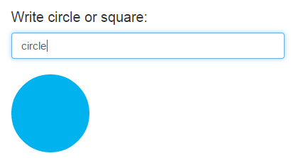

##Exercise 22 : templateUrl

Directive **url** has a big template, try resolve this problem by moving it to another file.

###Requirements
 * you can NOT change functionality directive
 * you can NOT change exist properties in directive

###Results
application should work the same as before the change

* type tex in **title**

* type text in **content**, click the button

* type ***secret*** in **title** field

###Before you start, please refer to:
* [angularjs-templateurl](https://egghead.io/lessons/angularjs-templateurl)

Good luck!
