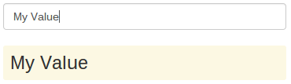
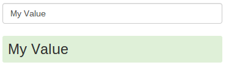

##Exercise 3 : Sharing data between controllers
Controllers often need to communicate and share data. You are given a task to create functionality to share data between two controllers.
Complete **index.html file** if you want to share data between **LeftCtrl** and **RightCtrl**.

###Requirements
* add **ng-controller's** and **ng-model's** in appropriate place
* all inputs should be binded to the same property and update when you type something either in left or right input

###Results

###Before you start, please refer to:
* [angularjs-the-dot](https://egghead.io/lessons/angularjs-the-dot)

Good luck!
