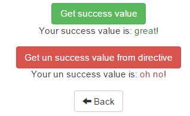

##Exercise 20 : angular.element

Write a directive which, depending on the entered values will change the class specified in directive input.

###Requirements
 * directive should be restricted as element.
 * the directive should react to any change in **input**.
 * when the **input** value is set to: *circle* or *square*, element class should be changed respectively on a ```circle``` or ```square```.
 * in other cases, it should display a red message *```You did not enter "circle" or "square"```* (using **text-danger** class).
 * to add class to element use **addClass('className')** function
 * to remove class from element use **removeClass('className')** function
 * to add text to element use **text(''someText')** function

###Results

* start view


* written some text


* written 'circle'


* written 'square'



###Before you start, please refer to:
* [angularjs-angular-element](https://egghead.io/lessons/angularjs-angular-element)
* [angularjs-the-basics-of-scope-watch](https://egghead.io/lessons/angularjs-the-basics-of-scope-watch)


Good luck!
