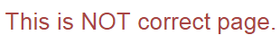

##Exercise 25 : $routeProvider

Use knowledge about elements as **$routeProvider**, **$routeParams** and **redirectTo** to create routing according to the requirements.
Views and controllers are ready (don't change them).

###Requirements
 * default page is **home.html**
 * **brand** and **capacity** from inputs are used as route params (take a look at home.html **Next step** button)
 * **Next step** button should redirect to **details.html** page (path should start with **details/**)
 * if in any field (brand or capacity) is entered word ***secret*** you should redirect to **secret.html** page
 * **hint** : check that the path of contains the word **secret** (you can split the path)
 * use in secretPage you can use **homeCtrl**
 
###Results

* without routing



* after correctly adding the default page


* after pressing the "Next step" button


* after typing the word 'secret' in any field and pressing **Next step** button


###Before you start, please refer to:
* [angularjs-routeprovider-api](https://egghead.io/lessons/angularjs-routeprovider-api)
* [angularjs-routeparams](https://egghead.io/lessons/angularjs-routeparams)
* [angularjs-redirectto](https://egghead.io/lessons/angularjs-redirectto)

###ngRoute
* run ```bower install``` command to download required dependencies


Good luck!