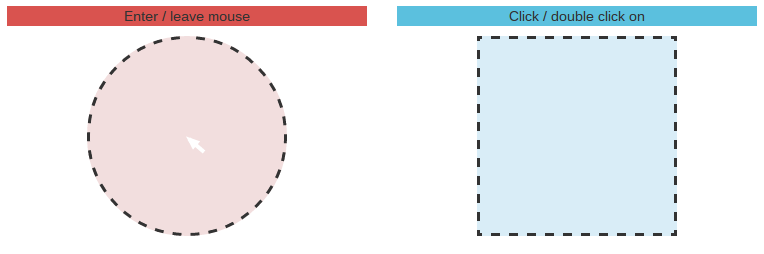

#Exercise 8 : Angular first directive

##Summary
The world need more heroes. You are given a hard task to create at least two heroes and one superhero. Implement three simple directives that will
allow you to create as many heroes as you need.


##Goals
* ***hero*** directive restricted as element and with given template as follows: 

*``````*

* ***mask*** directive restricted as element and with given template as follows: 

*``````*

* ***superhero*** directive restricted as element with template that use previous directives  - you should put mask after the hero element (use directives inside template 

*```<div class="relative-position">....</div>```* 

* Directives used in correct places at **index.html** (check comments)

The **superhero** should look as follows:



##Setup
You should have installed `npm`, `bower`, `grunt`  packages to run this example. First, run sequentially

```
npm install
```

```
bower install
```

To start the application, run

```
grunt serve
```

To start unit test, run

```
grunt karma
```

###Before you start, please refer to:
* [angularjs-first-directive](https://egghead.io/lessons/angularjs-first-directive)
* [write-your-first-directive](https://egghead.io/lessons/write-your-first-directive)

Good luck!
