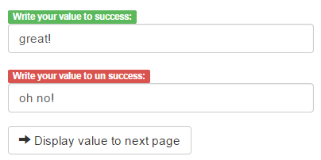
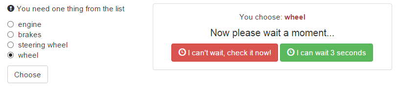

##Exercise 36b: ng-repeat-start
The goal of this exercise is practise ng-repeat-start

###Requirements 
* don't change table structure
* use ng-repeat-start directive to achieve the effect as in section
* check out comments

###Results

* start view

* click at user

!

###Before you start, please refer to:
* [angularjs-ng-repeat-start](https://egghead.io/lessons/angularjs-ng-repeat-start)

Good luck!
