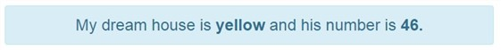

##Exercise 30 : Providers

###The goals
Application displays sentence in which **color** and **number** are set by provider. Your job is replace the **home** factory with the **home** provider.

###Requirements
* **color** should be hardcoded in provider configuration
* **number** should be a random number

###Result

###Before you start, please refer to:
* [angularjs-providers](https://egghead.io/lessons/angularjs-providers)

Good luck!
