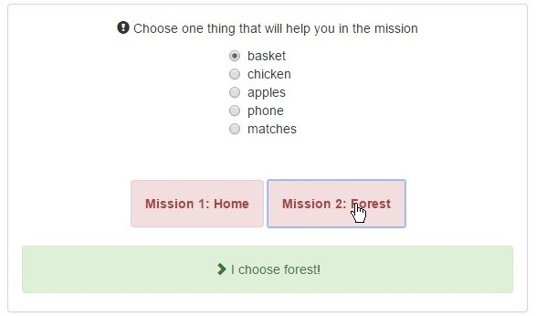
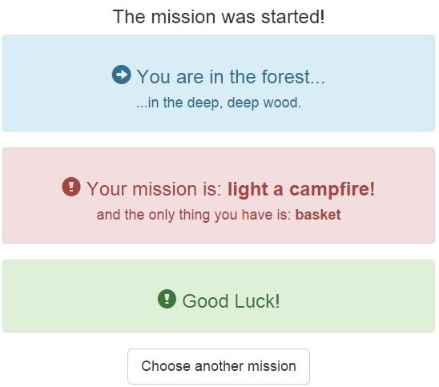

##Exercise 29 : Route Life Cycle

###The goal
You start with the ready view, where you will find two missions and an object which you can take with you.
When you select a mission, it should display an alert message for two seconds. Then you will be redirected to the appropriate page of the mission.

###Requirements
* alert message before route change $scope should be set to ***"I choose home!"*** or ***"I choose forest!***
* start message when route start change $scope should be set to ***""The mission was started!"***
* depending on the **space** attribute (received from promise) when route change is success ***mission*** should be set to ***to make dinner*** (when Home)
   ***light a campfire.*** (when Forest)
* **message** in controllers should come from **loadData**

###Result
* when the mission was chosen

* after redirecting

###Before you start, please refer to:
* [angularjs-route-life-cycle](https://egghead.io/lessons/angularjs-route-life-cycle)

Good luck!
