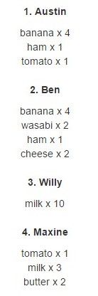

##Exercise 36 : ng-repeat-start
When you're hungry, you are not yourself. Check out, what your friends keep in the fridge. Your task is to display the name of a friends and the contents of their fridge in a designated place.

###Requirements
* wrap **id** and **name** with ```<p><strong>``` tags

###Result



###Before you start, please refer to:
* [angularjs-ng-repeat-start](https://egghead.io/lessons/angularjs-ng-repeat-start)

Good luck!
