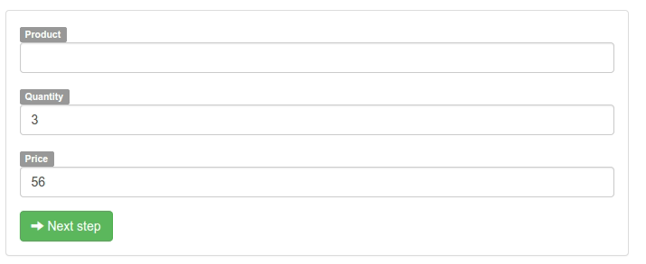
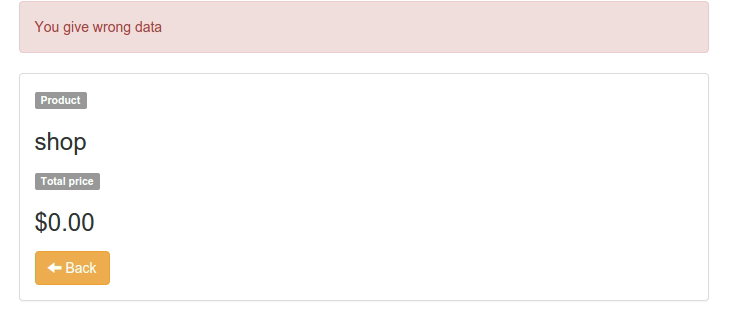
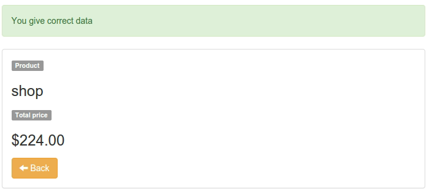

##Exercise 27 : resolve $routeChangeError


##The goal
The application is to process data from erroneously solved routing from promise

####Requirements
 * You can NOT change views
 * Add to resolve promises to routing when path indicated to **propertyOrder.html**
 * In resolve this promise you should use method *```reject```* with **productCatch**
 * In main controller you must catch this data from *```$rootScope```*
 * When *```name is incorrect you should redirect to default page```*.

  

 * And when name is correct but *```quantity and price is NOT correct you should display message 'You give wrong data' with class 'alert alert-danger```*

 

 * When is all correct you should display *```message 'You give correct data' with class alert alert-success and set cost in rejectProduct [quantity*price] and his name```* (hint:quantity may NOT be a fraction)

  

###Before you start, please refer to:
* [resolve conventions](https://egghead.io/lessons/angularjs-resolve-conventions)
* [routeChangeError](https://egghead.io/lessons/angularjs-resolve-routechangeerror)
* [location path](https://docs.angularjs.org/api/ng/service/$location)


Good luck!
