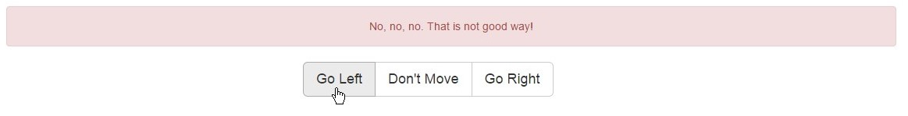

##Exercise 28 : Directive for route handling
###The goal
In this application, you are supposed to use $rootScope within an ***error*** directive to detect route change errors and display it.

###Requirements
* when it detects route change error, you should see a message ***"No, no, no. That is not good way!"***
* use ````ng-show```` directive to show the error alarm only when you need it.

###Result



###Before you start, please refer to:
* [angularjs-directive-for-route-handling](https://egghead.io/lessons/angularjs-directive-for-route-handling)

Good luck!
