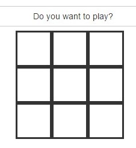

##Exercise 60: Test Simple Binding With Protractor
Protractor interacts with the application using its element and finder functions. In this application you can increase and decrease temperature. Try to complete two test cases in **index.spec.js** 

###Requirements
* test plus and minus button behavior
* load page before each test case

###Result



### Test Configuration:
* ```npm install -g protractor```
* ```webdriver-manager update```
* ```npm install -g httpster```
* ```bower install```

###Test start
* you need two terminal windows:
    * in the first go to the app folder ```cd app``` and run ```httpster``` command
    * in the second terminal window run tests with ```protractor test/protractor.conf.js```


###Before you start:
* [angularjs-test-simple-binding-with-protractor](https://egghead.io/lessons/angularjs-test-simple-binding-with-protractor)
* [protractor](http://angular.github.io/protractor/#/)

Good luck!
