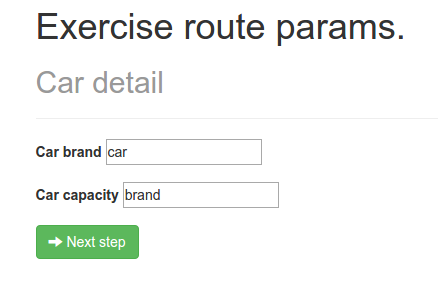
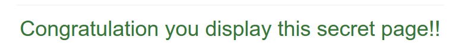

##Exercise 25 : $routeProvider

##The goal
Application should displays inputs and their value. Views and controller are ready.

####Requirements
 * You need configure routing so as to a default page was **home.html**

  

 * I must write some value to *```both inputs, only should become redirect```*
 * And I click ```Next step``` should be redirect to **display.html**

 

 * On this view you should display values from inputs.
 * When I wrote in the *```some input secret I should redirect to secret page```*

 
 
 

 * You can NOT change views and controller.

###Before you start, please refer to:
* [routeProvider api](https://egghead.io/lessons/angularjs-routeprovider-api)
* [routeParams](https://egghead.io/lessons/angularjs-routeparams)
* [redirectTo](https://egghead.io/lessons/angularjs-redirectto)
* type ```bower install``` in console to download required dependencies


Good luck!