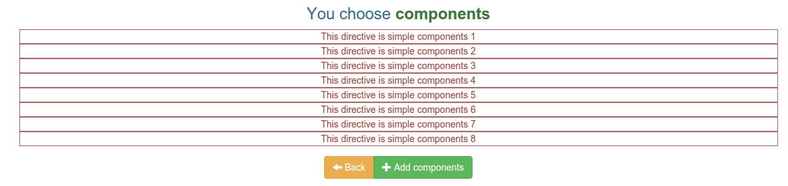
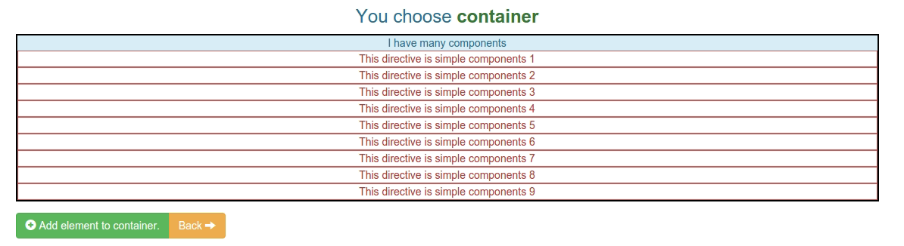

##Exercise 32b : Components and Containers

###The goal
Sometimes in application is written directives which we need them value to be displayed, meanwhile we don't want to move them from HTML file to directive.

####Requirements
  * You should configure routing (default page is **home.html**)
  * You should complete directives **myContainer** and **myComponent**
  * You should use class from **style.css** to add ```border``` directives.

  

  * Component should be add to the list to display, when You click add component.

  

  * You should use directive 'myComponent' in directive 'myContainer'.


###Before you start, please refer to:
  * [components and containers](https://egghead.io/lessons/angularjs-components-and-containers)


Good luck!