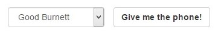
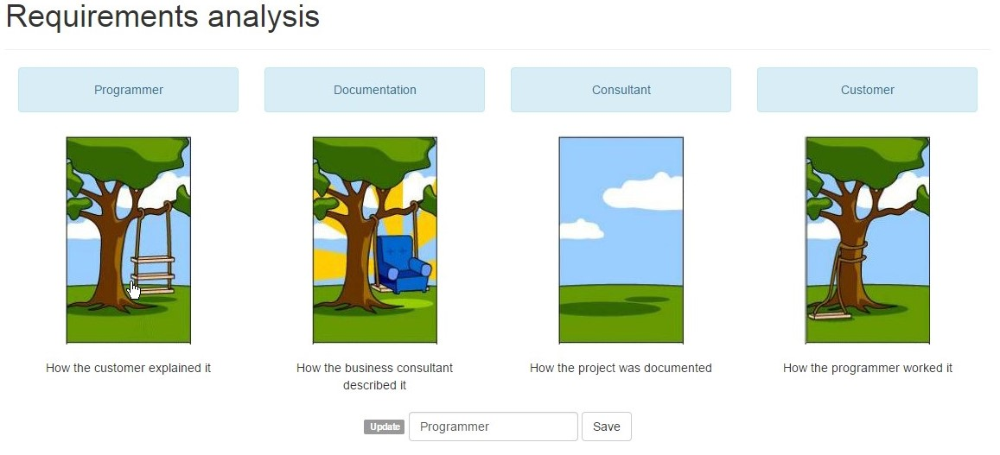
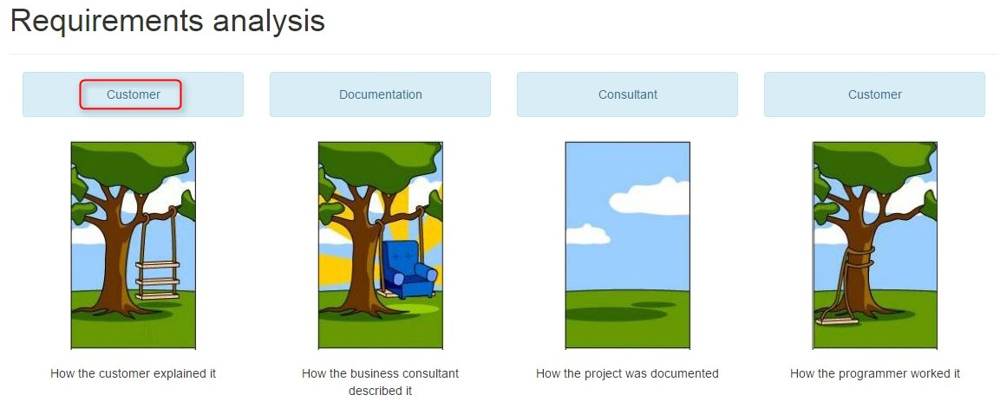

##Exercise 40 : angular.copy
Something bad happened to the titles of images. Use angular.copy to updates data when you click on the image.

###Requirements
* create **reverseColor** function responsible for switching colors when "Do you want to play?" button was pressed 
* in **chessboardField** directive you should observe whether the button was clicked, to add or remove class **.field**

###Result
* you start with

* when you click on the image

*

 

###Before you start, please refer to:
* [angularjs-animating-the-angular-way](https://egghead.io/lessons/angularjs-animating-the-angular-way)

Good luck!