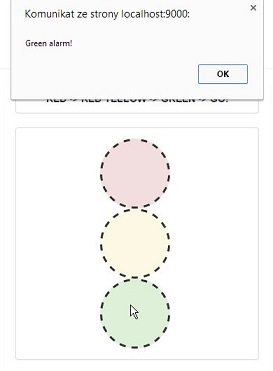

##Exercise 14 : Directive to Directive Communication

##The goal
In this exercise, your challenge is to share information between directives. Implement functionality that will allow to call alert when you click on red circle, double click on yellow circle and when the mouse hovers over the green circle. You are supposed to create four directives:
***alarm*** (main directive), ***red***, ***yellow***, ***green***

####Requirements
* main directive should include controller with three function (with names like pattern **addColorName**)
* the content of the alarms is a simple message ***"ColorName alarm!"***
* use directive in prepared div elements (check comment)
 
####Result example
* when the mouse hovers over the green circle

Good luck!
