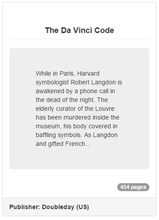

##Exercise 32 : Components And Containers
Start work with three "book-about" ready directives (**bookTitle**, **bookDescription**, **bookPages** . Use them as components to achieve the end effect such as in point "Result".

###Requirements
* **book** directive should be used as a container
* example book's title: ***"The Da Vinci Code"***

###Before you start, please refer to:
* [angularjs-components-and-containers](https://egghead.io/lessons/angularjs-components-and-containers)

###Result

Good luck!
