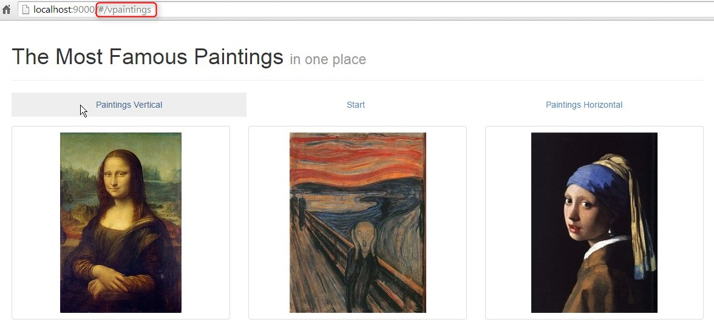
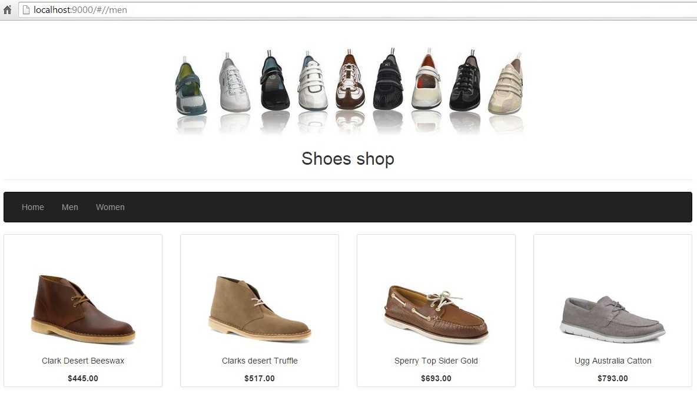
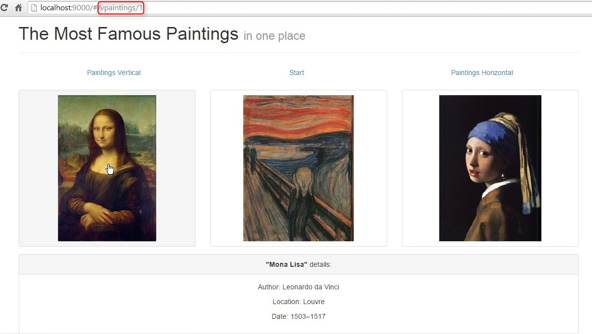

##Exercise 41 : Introduction to ui-router
Create navigation to a page that contains information about the most popular paintings. Use an alternative to AngularJS's default routing module: ui-router.

###Requirements
* implement tabs that redirect the user to:
    * the main page (redirect to **start** with  welcome information)
    * vertical paintings list (redirect to **vpaintings**)
    * horizontal paintings list (redirect to **hpaintings**)
    * otherwise redirect user to start page
* you should see the details about painting when it is clicked

###Result
* you start with

* paintings list

* horizontal paintings details

* vertical paintings details

###Before you start, please refer to:
* [angularjs-introduction-ui-router](https://egghead.io/lessons/angularjs-introduction-ui-router)

Good luck!