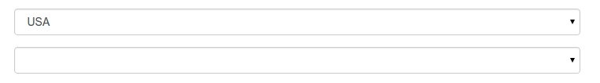
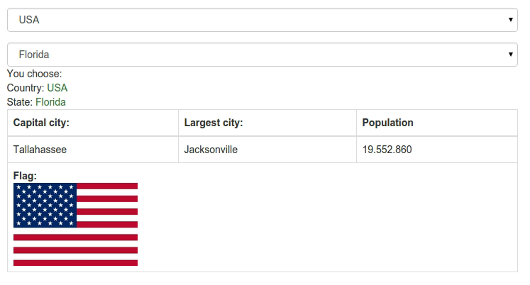
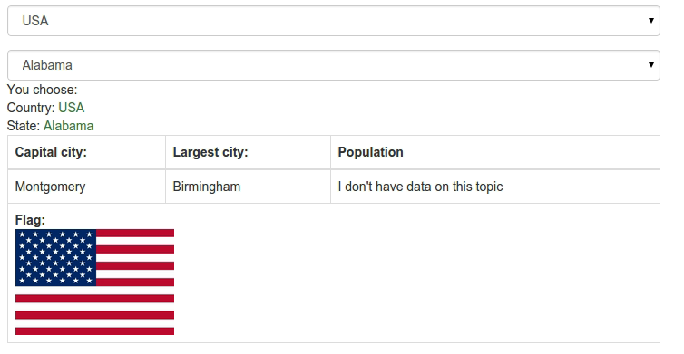

##Exercise 35b: Directive Communication


Sometimes directive have to use data from another directives and controllers, in this application must build chain directives
which display template when previous directive is set to.
###Requirements
  * Add all require files to application.
  * You need configure routing so as to a default page was **home.html**
  * You can NOT change **home.html**
  * Complete method in factory:
    * **getListState** should returns list from listState which You choose
    * **getDetails** should returns details state which You choose (choose country and state)

  * In directive **country** should only be able to see template in code, not the directive element itself,
  this directive should be transparent, set correct template and controller (hint: watch name).

  

  * On screen You can see the second ```select``` this select is bind from **state** this select You can choose
  state from choose country, in directive complete method link, should You watch on data in **countryCtrl** use this data to
  load data in stateCtrl complete method **chooseCountry** and display this data on the template.

  

  * Check template and create correct properties to display data.
  * Watch on population You must defined a filter to obtain such a result, when population NOT exist, display message:```I don't have data on this topic```
  This filter must to defined in config module.

  

###Before you start, please refer to:
* [Directive communication](https://egghead.io/lessons/angularjs-directive-communication)
* [$filterProvider](https://code.angularjs.org/1.2.16/docs/api/ng/provider/$filterProvider)
* [The basics of scope watch](https://egghead.io/lessons/angularjs-the-basics-of-scope-watch)


Good luck!