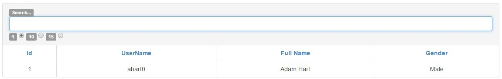
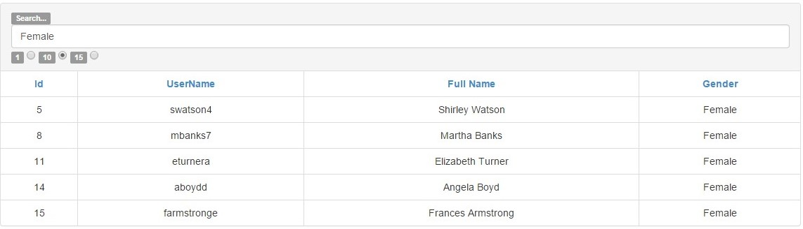

##Exercise 7 : Angular built in filters

In this application, you are supposed to use ready-made filter options. You start with a ready list of users.

###Requirements
* limit the number of displayed records with the radio choice (default limit should be 15)
* you should be able to sort data by column
* create and use ***reverseSort*** function that sort the data ascending and descending
  (take a look at **orderBy** documentation)
###Result
* set limit to **1**

* write **Female**

###Before you start, please refer to:
* [angularjs-built-in-filters](https://egghead.io/lessons/angularjs-built-in-filters)
* [orderBy](https://docs.angularjs.org/api/ng/filter/orderBy)

Good luck!
