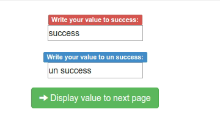
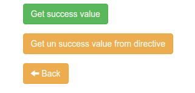
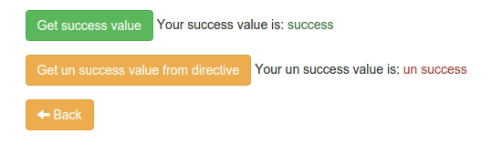

##Exercise 34b: "Controller as" Syntax

Setting data on scope is dangerous because it makes available everywhere, wherefore used setting data on controller and simplifies access to the this data new structure.

###Requirements
  * Complete method **getSuccess** and **getUnSuccess** in service (should returns promises).
  * Complete methods **set** to set data in service, **get** and **getUnSuccess** should resolve promise or catch reject from method in service.
    * method **get** should set *```success```* property on controller
    * method **getUnSuccess** should set *```unSuccess```* property on controller
  * Complete template in directive:
    * when You click a button invoke function **getUnSuccess** from **unSuccessCtrl**,
    * use *```ngIf```* to to display value when property *```usSuccess```* in controller is defined with message: *```Your un success value is: ```*.

###Result
 * Main window:

 

 * When You go to **Next page**

 

 * Whe You resolved all promises

 

###Before you start, please refer to:
* [controller as syntax](https://egghead.io/lessons/angularjs-experimental-controller-as-syntax)

Good luck!
