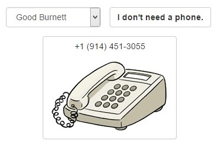
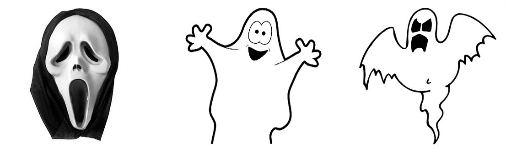

##Exercise 37 : Animation Basics
Use the angular-animate to create a really scary ghosts. Complete three style.css in accordance with the requirements.

###Requirements
*  **ghost** should change the visibility of the image within two seconds
*  **ghost2** should change the size of the image within one second (start animation - increase, leave - decrease)
*  **ghost3** should change the size and the visibility of the image within three second

###Result
* button pressed





###Before you start, please refer to:
* [angularjs-animation-basics](https://egghead.io/lessons/angularjs-animation-basics)
* use ```bower install```, then add **angular-animate.js** to index.html and include dependency in application module

Good luck!
