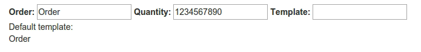
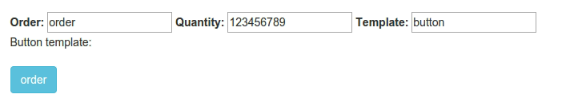
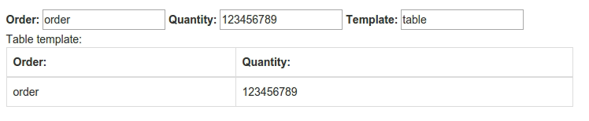
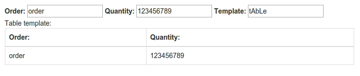

##Exercise 23 : templateCache

##The goal
In the application, the same data can be displayed in several different method,
depending on the given method is changed template in directive. All templates are ready and their behavior.


####Requirements
 * You can NOT change **return** in directive.
 * You have to add **template** to cache templates.
 * Default template is display only *```order```*

 

 * When You write in the **template** *```button you should see```* a **button** *```when write something in the order```*

 

 * When You write **table**, You should be see a table with data

 

 * Should NOT matter sizes characters

 

###Before you start, please refer to:
* [angular templateCache](https://egghead.io/lessons/angularjs-templatecache)
* [$compile](https://code.angularjs.org/1.2.16/docs/api/ng/service/$compile)
* [$watch](https://egghead.io/lessons/angularjs-the-basics-of-scope-watch)


Good luck!